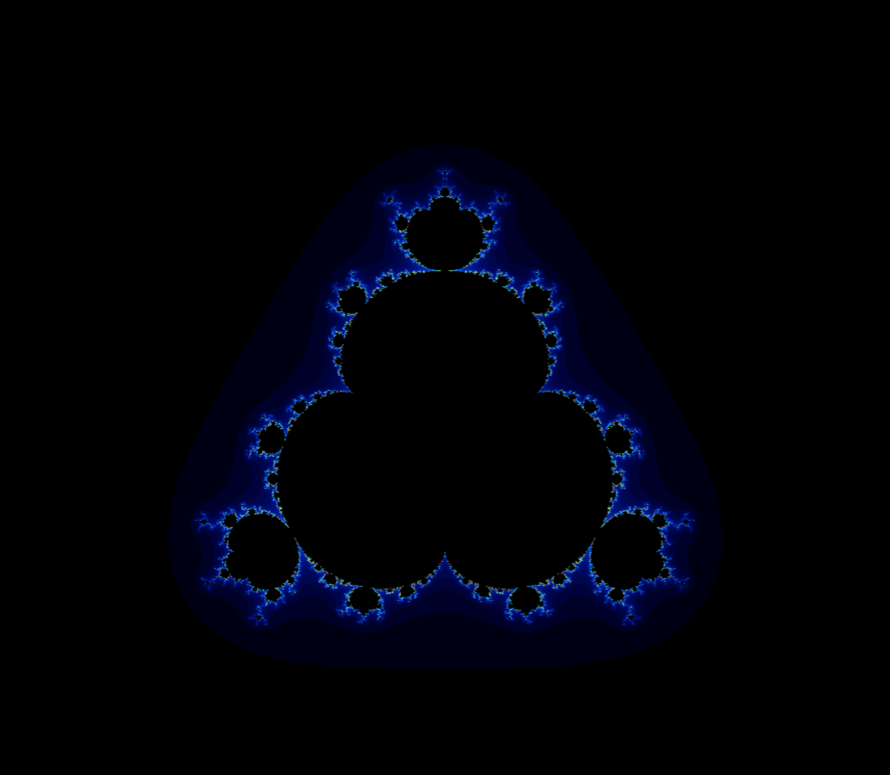
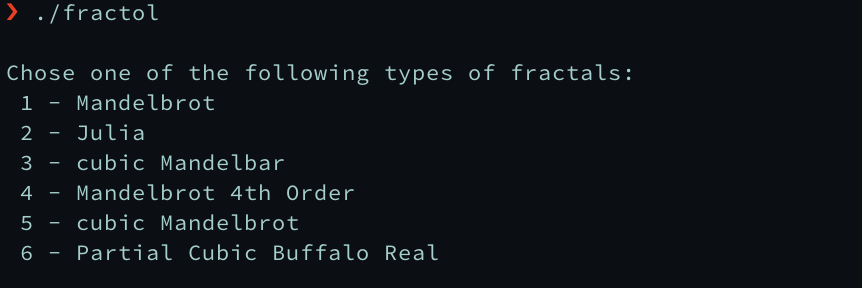

# Fract'ol

This project seeks to create a small fractal exploration program.
The program has 6 different types of fractals, in which some vary with the
mouse. Using the mouse, one can also zoom in and zoom out, change colors, and
reset the fractals to the default values. There's also a play of color to feel
the depth of each fractal.

<table style="width:100%">
  <tr>
    <td></td>
    <td></td>
    <td></td>
  </tr>
<tr>
    <td></td>
    <td></td>
    <td></td>
  </tr>
</table>

## Getting Started

### Compiling

Run the following commands:

* To compile
	- `make`
* To remove objects:
	- `make clean`
* To remove objects and binary file (program):
	- `make fclean`
* To re-compile:
	- `make re`

### Executing

To execute the program:

`./fractol <fractal-number>`

*See usage message to see a list of available fractals*

#### Try it!

Try running the following:

`./fractol mandelbrot`

`./fractol julia`

`./fractol sphere`

## Screenshots

**Usage message and controls:**

**Program running:**

